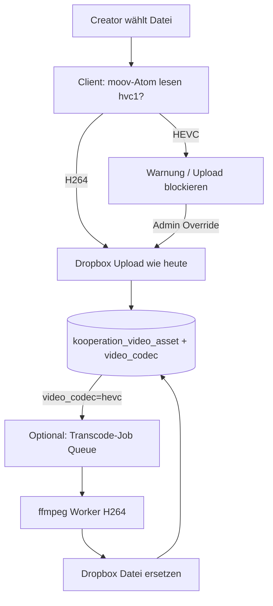

# HEVC-Video-Problem: Sofortmaßnahmen, Player-Fix & einheitliches H.264

## Diagnose (bestätigt)

- Kunde: **Google Chrome + Windows 11**
- Symptom: Ton läuft, Bild bleibt grau — kein `error`-Event am `<video>`
- Ursache: **HEVC/H.265 (`hvc1`) in `.mp4`-Containern** — Windows/Chrome dekodiert HEVC ohne kostenpflichtige Erweiterung nicht
- Betroffene Beispiele: Lilli Czerny (Butter Mochis v2, Limetten Cookies v2)
- Funktionierende Beispiele: Lukas Grett (Arayes), Jessie Leidig (Trendburger v2) — alles **H.264 (`avc1`)**


---

## A) Sofort: Was der Kunde tun kann

| Maßnahme | Aufwand | Erfolgsaussicht |
|----------|---------|-----------------|
| **HEVC Video Extensions** im Microsoft Store installieren (~0,99 €) | 2 Min | Hoch — danach dekodiert Chrome/Edge HEVC |
| **Microsoft Edge** statt Chrome testen (mit gleicher Erweiterung) | 1 Min | Hoch |
| **Download-Button** im Player nutzen, lokal mit **VLC** oder **Filme & TV** abspielen | 1 Min | Sehr hoch (VLC spielt alles) |
| Chrome: Einstellungen → System → **Hardwarebeschleunigung** ein/aus toggeln | 2 Min | Mittel (GPU-Decoder-Bug aushebeln) |
| Mac/iPhone/Safari nutzen | — | Sehr hoch (Apple-HEVC-Decoder) |

**Empfehlung an Kunden (Copy-Paste):**
> „Ihr Browser kann das Video-Format (HEVC) auf Windows nicht darstellen. Bitte installieren Sie ‚HEVC Video Extensions‘ aus dem Microsoft Store — oder laden Sie das Video per Download-Button herunter und öffnen Sie es mit VLC.“

---

## B) Kurzfristig: Plattform-Fix (1–2 Tage)

### Problem im Code

[`VideoPlayerLightbox._onVideoError`](src/core/media/VideoPlayerLightbox.js) reagiert nur auf `error`-Events. HEVC-ohne-Decoder wirft **keinen Fehler** — nur `videoWidth === 0`.

[`VideoPlayerView._formatHint`](src/core/media/VideoPlayerView.js) warnt nur bei `.mov|.avi|.mkv|.m4v` — **nicht** bei HEVC-in-`.mp4`.

### Implementierung

1. **Neues Modul** `src/core/media/VideoDecodeProbe.js`
   - Nach `loadedmetadata` + `playing`: Timeout (~500–1500 ms)
   - Prüfung: `video.videoWidth === 0 || video.videoHeight === 0`
   - Optional: `requestVideoFrameCallback` (Chrome) für zuverlässigere Frame-Erkennung
   - Callback: `onUndecodable()` → Fallback-UI

2. **Integration in** [`VideoPlayerLightbox.js`](src/core/media/VideoPlayerLightbox.js)
   - In `_applySrc()` und `_mount()` neben bestehendem `error`-Listener
   - Bei Treffer: `_onVideoUndecodable()` (analog `_onVideoError`, eigener Text)

3. **UI in** [`VideoPlayerView.js`](src/core/media/VideoPlayerView.js)
   - `renderUndecodable(link)` — spezifischer Text:
     - „Video-Format wird in Ihrem Browser nicht unterstützt (HEVC/H.265)“
     - Buttons: **Herunterladen**, **Extern öffnen** (Dropbox), Hinweis auf HEVC Extensions
   - `_formatHint()` erweitern oder durch Decode-Probe ersetzen

4. **CSS** — Overlay über grauem Video, Controls bleiben nutzbar

### Keine Schema-Änderung nötig für Sofort-Fix

---

## C) Langfristig: Einheitliches H.264 für alle Browser

### Ziel-Format

| Parameter | Wert |
|-----------|------|
| Container | `.mp4` |
| Video | H.264 / AVC (`avc1`), Profile High oder Main |
| Audio | AAC (`mp4a`) |
| Auflösung | Wie Quelle (1080p/4K ok bei H.264) |

### Optionen-Analyse

| Ansatz | Pro | Contra | Empfehlung |
|--------|-----|--------|------------|
| **Client-Validierung beim Upload** | Sofort, kein Infra | Blockiert nicht externe Dropbox-Uploads | **Phase 1 — ja** |
| **Creator-Richtlinie** (Export H.264) | Kostenlos | Menschlicher Faktor | **Parallel — ja** |
| **ffmpeg in Netlify Function** | Alles in Stack | 10s Timeout, 1024MB Limit, kein ffmpeg binary, 200MB+ Videos | **Nein** |
| **Mux / Cloudflare Stream** | Robust, adaptive | Kosten, Architektur-Umbau, Videos verlassen Dropbox | Overkill |
| **Externer Worker** (Railway/Modal + ffmpeg) | Skaliert, Dropbox-in/out | Neues Deployment | **Phase 2 — empfohlen** |
| **Manuelles Batch-Script** (lokal ffmpeg) | Schnell für Backfill | Nicht automatisiert | **Backfill — ja** |

### Empfohlener pragmatischer Weg (Netlify + Dropbox)



**Phase 1 (Upload-Schutz):**
- Neues Util `src/core/media/probeVideoCodec.js` — liest erste ~512KB + moov-Tail, erkennt `hvc1`/`hev1`/`avc1`
- Einbinden in [`runVideoUploadJob.js`](src/core/uploadJobs/runVideoUploadJob.js) und [`runStorysUploadJob.js`](src/core/uploadJobs/runStorysUploadJob.js) **vor** `uploadFileDirect`
- Toast/Modal: „Bitte als H.264 exportieren“ + Link zu Anleitung
- Optional: Admin-Rolle darf trotzdem hochladen

**Phase 2 (DB-Metadaten):**
- Migration: `video_codec text` auf `kooperation_video_asset` + `kooperation_story_asset`
- Beim Upload speichern (`h264` | `hevc` | `unknown`)

**Phase 3 (Transcoding — optional automatisiert):**
- Supabase Edge Function oder separater Service: bei `video_codec=hevc` → Job in Queue
- Worker (Railway/Modal): Download von Dropbox → `ffmpeg -c:v libx264 -preset fast -crf 23 -c:a aac` → Upload zurück → DB-Update
- **Nicht** in Netlify Functions (Timeout/Größe)

**Phase 4 (Creator-Guideline):**
- Kurzes Doc für Editing-Team: Final Cut/Premiere/DaVinci → Export „H.264“, nicht „HEVC“ / „High Efficiency“

---

## D) Backfill: Bestehende HEVC-Assets

### 1. Inventar

- Script `scripts/scan-video-codecs.js`:
  - Alle `kooperation_video_asset` + `kooperation_story_asset` mit `file_url`/`file_path` laden (Supabase service role)
  - Pro Datei: moov-Atom parsen (wie bereits per Python getestet)
  - CSV/JSON: `id, variant_name, codec, file_path, kampagne`

### 2. DB markieren

- Nach Scan: `video_codec` Spalte befüllen
- Admin-Report: „X Videos HEVC betroffen“

### 3. Transkodieren

- **Manuell (schnellster Start):** Batch-Script mit ffmpeg lokal:
  ```bash
  ffmpeg -i input.mp4 -c:v libx264 -preset fast -crf 23 -c:a copy -movflags +faststart output.mp4
  ```
  → Dropbox ersetzen (gleicher `file_path`) → Asset bleibt gleich, Inhalt wird H.264

- **Automatisiert:** Gleicher Worker wie Phase 3, getriggert per `POST /.netlify/functions/backfill-transcode?dryRun=true` (Muster wie [`backfill-thumbnails.js`](netlify/functions/backfill-thumbnails.js))

### Priorität Backfill

1. Meggle Jahreskampagne 2026 — Lilli Czerny (3 Videos bestätigt HEVC)
2. Alle `_NEU`-Varianten aus Scan
3. Restliche HEVC-Assets

---

## Umsetzungs-Reihenfolge

| Prio | Task | Aufwand |
|------|------|---------|
| 1 | Kunden-Antwort (HEVC Extensions / Download) | 5 Min |
| 2 | Player: `videoWidth===0`-Erkennung + Fallback-UI | 0.5–1 Tag |
| 3 | Codec-Scan-Script + Inventar | 0.5 Tag |
| 4 | Upload-Validierung (HEVC blockieren/warnen) | 0.5 Tag |
| 5 | DB-Spalte `video_codec` | 0.5 Tag |
| 6 | Backfill betroffene Meggle-Videos (manuell ffmpeg) | 1 Tag |
| 7 | Transcode-Worker (optional, automatisieren) | 2–3 Tage |

---

## Relevante Dateien

| Bereich | Datei |
|---------|-------|
| Player Orchestrator | [`src/core/media/VideoPlayerLightbox.js`](src/core/media/VideoPlayerLightbox.js) |
| Player UI / Hints | [`src/core/media/VideoPlayerView.js`](src/core/media/VideoPlayerView.js) |
| Controls | [`src/core/media/VideoPlaybackController.js`](src/core/media/VideoPlaybackController.js) |
| Video Upload | [`src/core/uploadJobs/runVideoUploadJob.js`](src/core/uploadJobs/runVideoUploadJob.js) |
| Story Upload | [`src/core/uploadJobs/runStorysUploadJob.js`](src/core/uploadJobs/runStorysUploadJob.js) |
| Upload Utils | [`src/core/VideoUploadUtils.js`](src/core/VideoUploadUtils.js) |
| Dropbox Path | [`netlify/functions/dropbox-upload.js`](netlify/functions/dropbox-upload.js) |
| Backfill-Muster | [`netlify/functions/backfill-thumbnails.js`](netlify/functions/backfill-thumbnails.js) |
